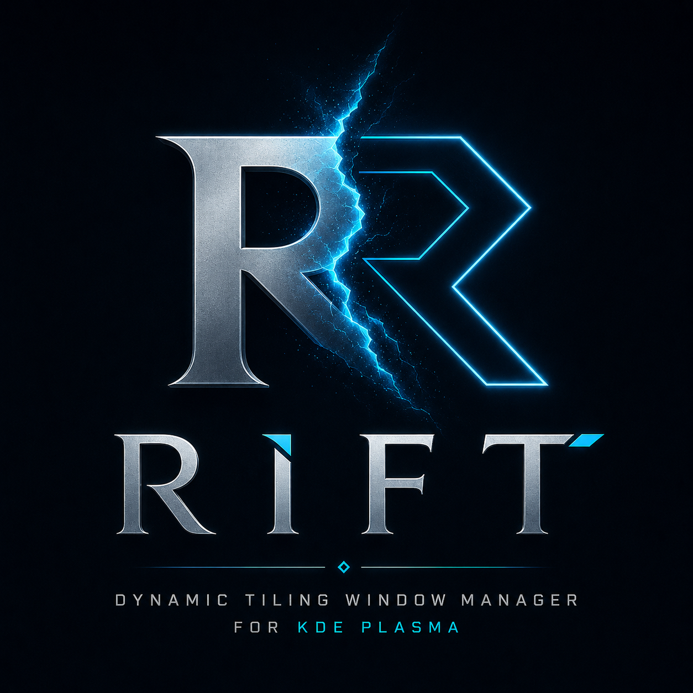

<p align="center">
  
</p>

<h1 align="center">Rift</h1>

<p align="center">
  <strong>A dynamic tiling window manager for KDE Plasma, built in Rust</strong>
</p>

<p align="center">
  
  
  
  
  
  
  
</p>

---

> **Status: experimental — a concept, not a daily driver.**
> I primarily use [krohnkite](https://github.com/esjeon/krohnkite) day to day.
> Rift is me tinkering with a different shape: take the things I like about
> krohnkite's tiling and pair them with what I like about COSMIC's approach, but
> move the layout engine into a standalone Rust daemon instead of an
> in-compositor script. Treat it as a playground for that idea — expect rough
> edges and breaking changes.

## Overview

Rift is a dynamic tiling window manager for KDE Plasma on Wayland. Inspired by
the COSMIC desktop's approach to tiling, it moves the layout engine out of a
fragile in-compositor script and into a dedicated Rust daemon, leaving only a
thin agent inside KWin.

The result is automatic tiling that survives monitor changes, suspend/resume,
and virtual-desktop switches without windows getting stuck fullscreen or
falling out of the layout. State is reconciled against the live KWin topology
on every event, so a desktop or output can never be left holding a stale layout.

## Features

### Dynamic Tiling
- Automatic placement of new windows into the active layout
- Multiple layouts: tile, monocle, columns, spiral, three-column, floating
- Per-output, per-desktop, and per-activity layout state
- Master/stack model with adjustable ratios and counts

### Multi-Monitor
- Independent layouts per output that reconcile on hotplug
- Move windows and focus across screens with the keyboard
- No stuck output after monitor sleep, DPMS, or reconnect

### Reliability by Design
- Layout state derived from live KWin topology, never persisted as truth
- Orphaned window and cell references pruned on every reconcile
- `riftctl reset` to force a clean re-tile without restarting the session

### Control
- Keyboard-driven focus, movement, resize, and layout switching
- TOML configuration with live reload
- `riftctl` for scripting and recovery

## Architecture

Rift splits responsibilities between a Rust daemon that owns all layout logic
and a minimal KWin script that acts as its hands inside the compositor.

```
┌──────────────────────────────────────────────────────────────────────┐
│                                 RIFT                                   │
├──────────────────────────────────────────────────────────────────────┤
│                                                                        │
│   ┌────────────┐   IPC    ┌──────────────┐   KWin    ┌────────────┐   │
│   │  riftctl   │◄────────►│    riftd      │◄─────────►│ rift-kwin  │   │
│   │   (CLI)    │  socket  │ (Rust daemon) │  events/  │ (KWin/TS)  │   │
│   └────────────┘          │               │  geometry └─────┬──────┘   │
│                           │  - layouts    │                 │          │
│                           │  - cells      │                 ▼          │
│                           │  - reconcile  │           ┌────────────┐   │
│                           └──────────────┘           │    KWin     │   │
│                                                        │ (compositor)│  │
│                                                        └────────────┘   │
└──────────────────────────────────────────────────────────────────────┘
```

- **rift-kwin** — a small KWin script (TypeScript → JS). It subscribes to window
  and topology events, forwards them to the daemon, and applies the geometry the
  daemon returns. It contains no layout logic.
- **riftd** — the Rust daemon. It holds the layout engine and the per-cell state,
  reconciles against the current topology, and computes window geometry.
- **riftctl** — a CLI over the daemon's IPC socket for layout control, queries,
  and recovery.

## Tech Stack

| Layer | Technology |
|-------|------------|
| **Daemon** | Rust (2024 edition) |
| **KWin integration** | KWin Script (TypeScript → JS) |
| **IPC** | Unix domain socket (user-scoped) |
| **Configuration** | TOML |
| **Compositor** | KWin on Wayland |
| **Desktop** | KDE Plasma 6 |
| **Target** | Arch Linux |

## Quick Start

### Prerequisites
- KDE Plasma 6 on Wayland
- Rust toolchain (2024 edition)
- Node.js (to build the KWin script)

### Build and install

```bash
# Clone
git clone https://github.com/ghostkellz/rift.git
cd rift

# Build the daemon
cargo build --release

# Build and install the KWin script
just install-kwin        # or: ./scripts/install-kwin.sh

# Enable the KWin script
kwriteconfig6 --file kwinrc --group Plugins --key rift-kwinEnabled true
qdbus6 org.kde.KWin /KWin reconfigure

# Start the daemon
./target/release/riftd
```

### First run

```bash
# Confirm the daemon is up and managing windows
riftctl status

# Force a clean re-tile if anything looks off
riftctl reset
```

## Project Structure

```
rift/
├── crates/
│   ├── riftd/              # Daemon: layout engine, cells, reconcile, IPC server
│   ├── riftctl/           # CLI client
│   └── rift-ipc/          # Shared IPC protocol types
├── rift-kwin/             # KWin script (TypeScript source + build)
│   ├── src/               # Event forwarding + geometry application
│   └── metadata.json      # KWin script metadata
├── assets/                # Logo and branding
├── docs/                  # Documentation
└── tasks/                 # Working notes (todo, spec) — not part of releases
```

## Configuration

Rift reads `~/.config/riftrc` (TOML). Configuration is reloaded live.

```toml
[layout]
default = "tile"          # tile | monocle | columns | spiral | threecolumn | floating
master_ratio = 0.6
master_count = 1

[gaps]
inner = 8
outer = 12

[behavior]
per_desktop = true        # independent layout per virtual desktop
per_activity = true       # independent layout per activity
focus_follows_mouse = false

[keys]
# Bindings are registered through KWin/KGlobalAccel; see docs/keybindings.md
```

## Documentation

| Document | Description |
|----------|-------------|
| [Documentation index](docs/README.md) | Full table of contents |
| [Architecture](docs/architecture/overview.md) | Daemon ↔ KWin protocol, cell model, reconciliation |
| [Configuration](docs/config/reference.md) | Full `riftrc` reference |
| [Keybindings](docs/usage/keybindings.md) | Default bindings and customization |
| [Layouts](docs/layouts/overview.md) | Available layouts and behavior |
| [Troubleshooting](docs/troubleshooting/diagnostics.md) | Recovery and diagnostics |
